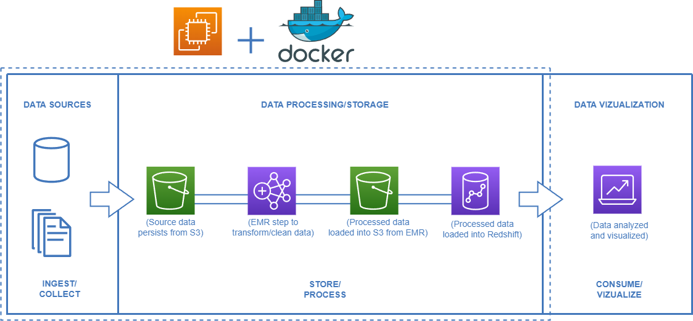
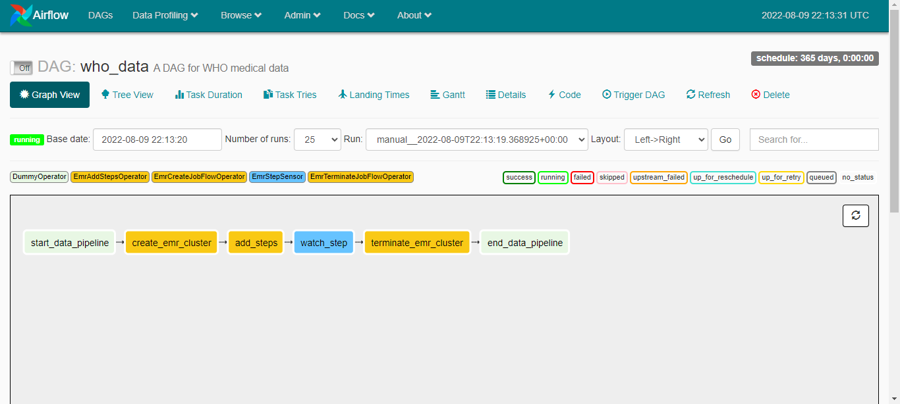

# Springboard Data Engineering Capstone 2

This is the repository for Dakota Brown's Springboard Data Engineering Capstone 2

# Prerequisites

1. [docker](https://docs.docker.com/get-docker/) (docker-compose will be needed as well).
2. [AWS account](https://aws.amazon.com/) to set up cloud services.
3. [Install](https://docs.aws.amazon.com/cli/latest/userguide/install-cliv2.html) AWS CLI on an EC2 instance.
4. [Configure](https://docs.aws.amazon.com/cli/latest/userguide/cli-configure-quickstart.html#cli-configure-quickstart-config) AWS CLI on an EC2 instance.

# Design



# Data

Finance data through Springboard


# Setup and run

If this is your first time using AWS, make sure to check for the IAM roles `EMR_EC2_DefaultRole` and `EMR_DefaultRole`.

```bash
aws iam list-roles | grep 'EMR_DefaultRole\|EMR_EC2_DefaultRole'
# "RoleName": "EMR_DefaultRole",
# "RoleName": "EMR_EC2_DefaultRole",
```

If the roles not present, create them using the following command

```bash
aws emr create-default-roles
```

Create an S3 bucket and load the scripts (located in code) into into a folder named scripts. 
Create a raw and transformed folder as well.

To start up airflow on your EC2 instance:

```bash
docker-compose -f docker-compose-LocalExecutor.yml up -d
```
(You can exchange LocalExecutor for CeleryExecutor as well)

Remove `-d` to see everything start up and view any errors if needed.

go to [http://localhost:8080/admin/](http://localhost:8080/admin/) and turn on the `finance_dag` DAG. You can check the status at [http://localhost:8080/admin/airflow/graph?dag_id=finance_dag](http://localhost:8080/admin/airflow/graph?dag_id=finance_dag). 



In EC2, make sure you're able to access the port airflow is bound to. The photo below helped me, however you would have to allow
public traffic to EMR or it would block the creation of the an EMR instance from EC2.


# Terminate local instance

```bash
docker-compose -f docker-compose-LocalExecutor.yml down
```


